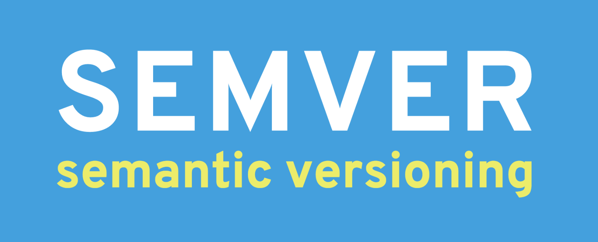
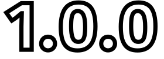
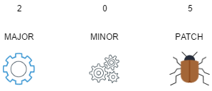
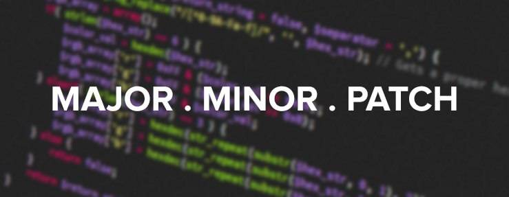

# [**Versionamiento Semántico**](https://semver.org/)

El versionamiento semántico se utiliza para la presentación de un software tambien denominado versión del proyecto ,el cual nos ofrece **reglas** para las versiones de un software.

## **Requisitos**
Definir una API pública , esta servira para la descripcion de lo cambios o de lo nuevo en nuestro poyecto , esto puede ir implicitamente o expliciamente escrito en código o una simple o compleja documentacion de los cambios o nopvedades generadsa en el proyecto


## **Explicación e implementación**
EL versionamiento semántico es un conjunto de números de cada version divididos en tres segmentos numéricos.Esto tiene como finalidad mostrar el estado del software. 



Cada una de estas siglas separada por el punto significa algo .



* El concepto de `MAJOR` se utiliza para los cambios mas potentes es decir los cambios mas significativos donde la vension es estable , en esta parte los cambios son totales, este se emplea para indicar cambios tanto externos como internos que resultan en hacer nuestro software no sea compatible con versiones anteriores. 

* El concepto de `MINOR` cuando se actualize una funcionalidad particular que no afecta a las demas se utilizara este campo

* El concepto `PATCH` se utiliza cuando se quiere hacer algun cambio de seguridad o arreglo de bugs




[**Otras fuentes AQUÍ**](https://thatcsharpguy.com/tv/semver/)

````python
    # Autor : Thom Maurick Roman Aguilar
    # Estudiante de la carrera Ingeniría de Sistemas
````